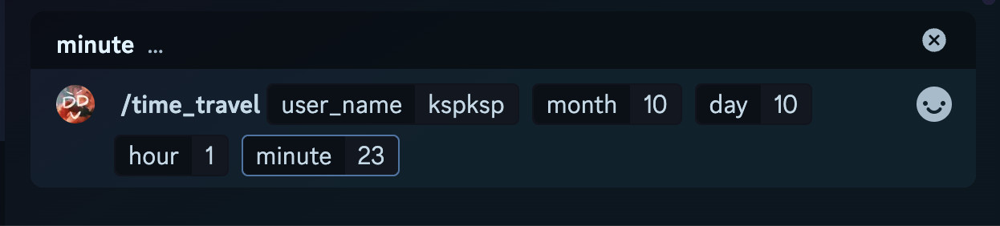

# OPEN DDV

> The open source repository of DDV.

## 專案介紹

這專案只是我用來複習多年沒碰的 Python，以及嘗試利用 AI 幫助我學習以前沒用過的東西，例如使用 Discord API 以及 Twitch API。
開發這隻小機器人的動機是為了方便自己當個補檔 DD。機器人命名靈感來自我最愛的女團「煌Sir有汐」歌詞：知道你們沒看 DVD 但很會 DDV。

*聲明：開發/學習過程中有利用 AI 輔助撰寫，之後會再把細節重新用我的方式重寫一次，讓它真正變成我學習、消化後的樣子。*

### Todos

- [ ] 修改成不用手動輸入完整 Twitch user name
- [ ] select channel 功能加強
- [x] 機器人權限調整
- [x] 功能：/demo 說明
- [x] 對訊息右鍵-->機器人查詢
- [x] 新功能公告機制: bot status

### Commands

1. /time_travel: 需要手動輸入實況主的 ID
   1. 以 Seki 為例，user_name 欄位要輸入她 twitch 帳號也就是 seki_meridian
      
   2. 接著輸入想查詢的時間點，年份已經預設為今年2024，只需手動輸入日期與時間。這裡則以 KSP 為例，假設想查詢的時間點為 10/10 01:23
      

2. /select_channel: 選擇指令並送出即可，不必另外輸入任何東西。
   1. 機器人會回覆一個下拉式選單，可以選擇想查詢的實況主/Vtuber，機器人會查出他/她最近的三則 VOD
      
      

3. /demo

### Roadmap

1. 支援 Youtube
2. 讓使用者自行決定追蹤清單（可以考慮抓取該使用者本人的 Twitch follow
   1. 追蹤帳號的代表色如何抓取
   2. 追蹤帳號的代稱可以怎麼設定
3. 抓取 VOD 聊天室
4. KSeki 特別版指令: 還沒想好，也許是專門擷取兩人在對方聊天室的留言，並且做成圖片。靈感來自 CodeSnap
5. 多畫面 DD 重播網頁
6. 簡便的 VOD 備份（yt 上傳+權限發佈在私人
7. last of the last:轉作工作用途

### Related Badges

